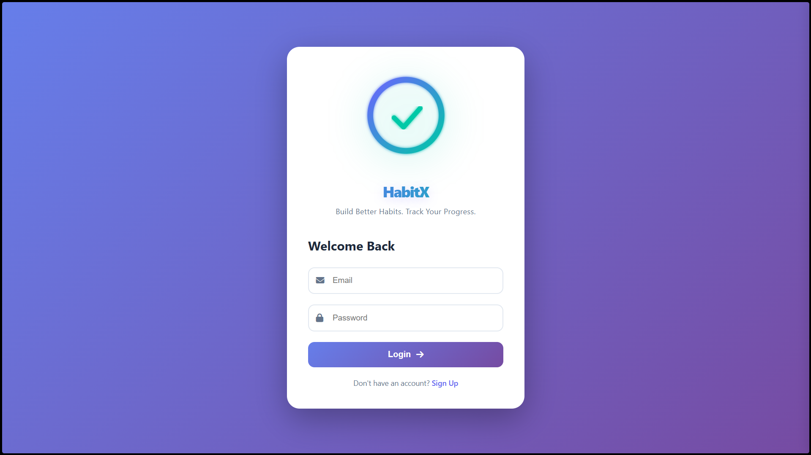
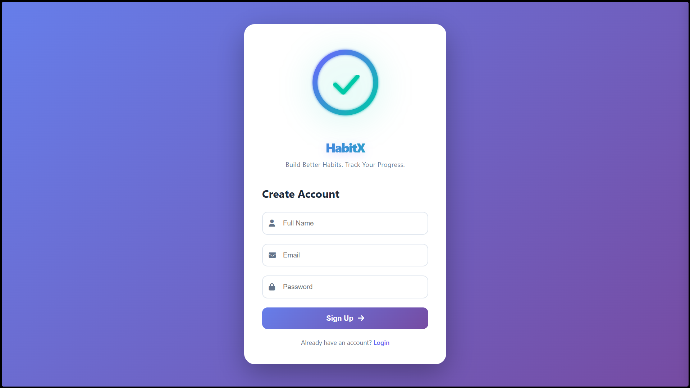
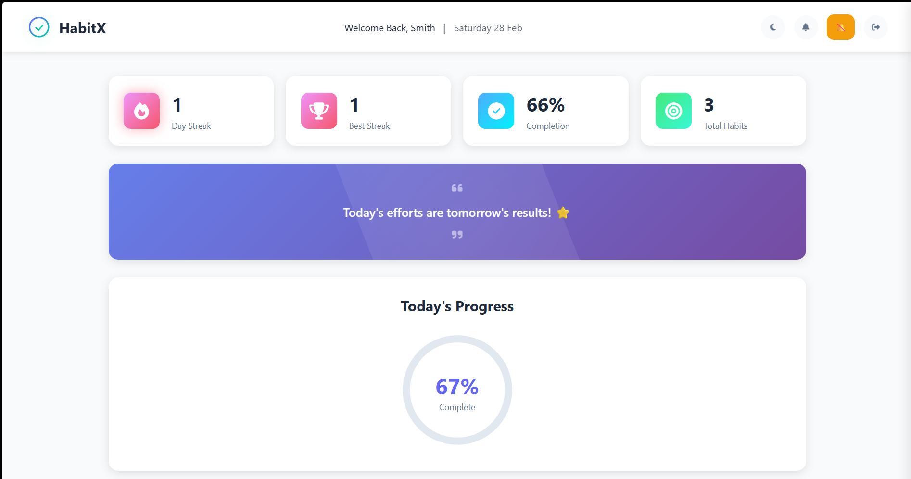
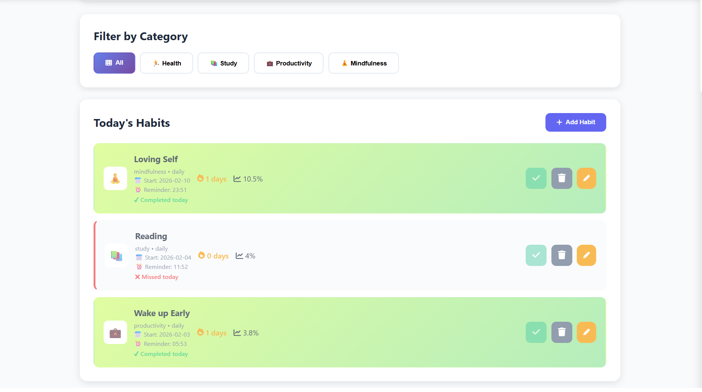
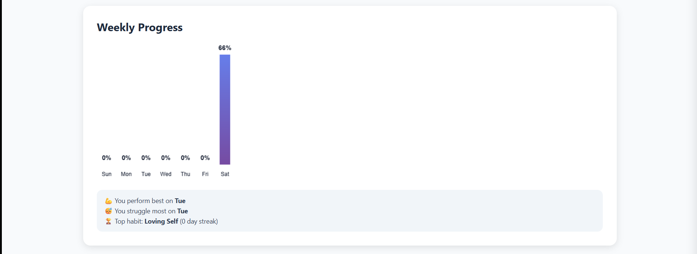
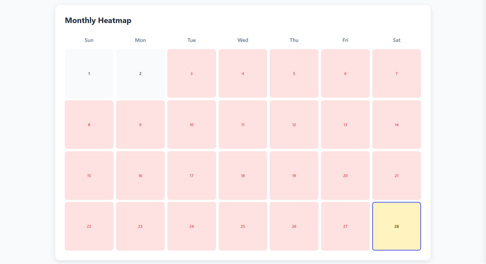
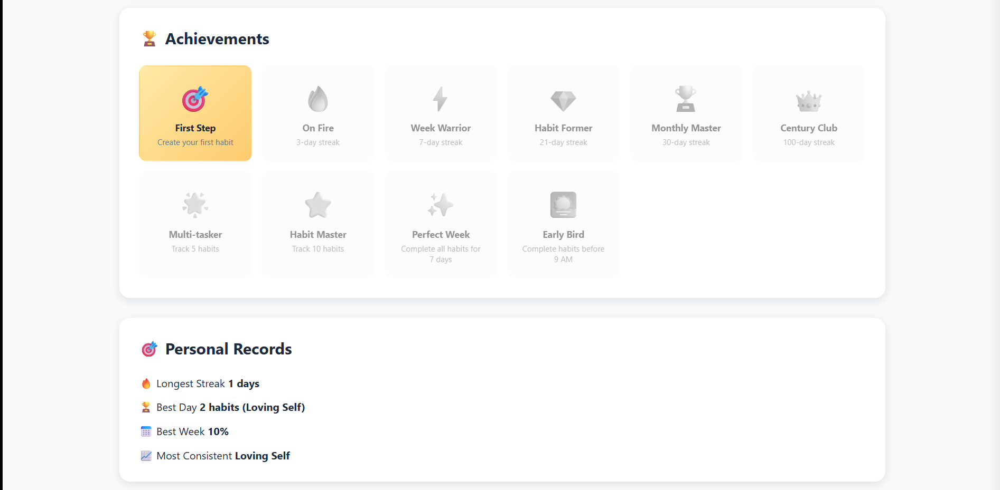
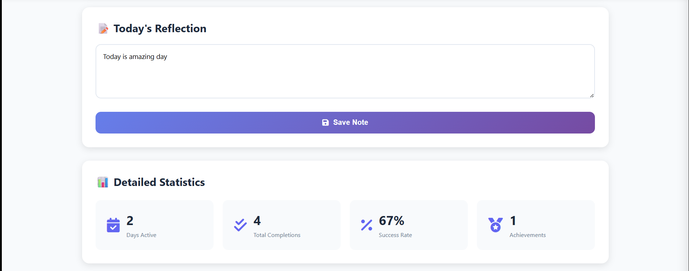
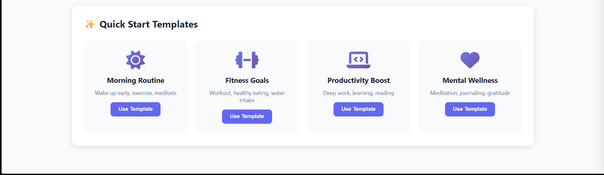

# HabitX - Smart Habit Tracker

HabitX is a full-stack web application designed to help users build
consistency, track habits, visualize progress, and stay motivated
through real-time analytics and achievements.

It combines clean UI design, structured backend logic, and data-driven
insights to create a complete productivity system.

------------------------------------------------------------------------

## Directory Structure

```
HabitX/
├── frontend/           # Client-side code (UI, assets)
│   ├── .vscode/        # editor settings
│   ├── app.js          # Frontend JavaScript (calls backend)
│   ├── index.html      # Main frontend HTML
│   ├── styles.css      # Frontend stylesheet
│   ├── static/         # frontend static assets (images, etc.)
│   └── templates/      # (optional templates used by frontend)
│           ├── dashboard.html  # Main dashboard template
│           ├── login.html      # Login page template
│           └── register.html   # Registration page template
│
├── backend/                # Flask backend (Python)
│   ├── app.py              # Flask application and API endpoints
│   ├── database.py         # simple DB/persistence helper (SQLite planned)
│   ├── achievements.py     # Achievement engine logic
│   ├── streaks.py          # Streak tracking logic
│   ├── progress.py         # Progress calculation logic
│   ├── records.py          # Personal records tracking logic
│   ├── habitx.db           # SQLite database file (created on first run)
│   └── requirements.txt    # Python dependencies
└── README.md               # This file
```

## Live Features Overview

### 1. Authentication System

-   User Registration
-   Secure Login
-   Logout functionality
-   Personalized dashboard per user

### 2. Smart Dashboard

-   Dynamic greeting with current date
-   Dark / Light mode toggle
-   Notification panel
-   Reminder toggle system
-   Real-time stats cards:
    -   Day Streak
    -   Best Streak
    -   Completion %
    -   Total Habits

### 3. Habit Management

-   Add / Edit / Delete habits
-   Mark habits as completed
-   Category filtering (Health, Study, Productivity, Mindfulness)
-   Reminder time tracking
-   Streak and performance tracking per habit

### 4. Visual Analytics

-   Today's Progress (circular progress indicator)
-   Weekly Progress (custom Canvas bar chart)
-   Monthly Heatmap (calendar consistency view)
-   Detailed statistics section

### 5. Achievement System

-   Auto-unlocked milestone badges
-   Streak-based rewards
-   Personal performance records

### 6. Productivity Tools

-   Daily reflection notes
-   Quick start habit templates
-   Motivational quote section

------------------------------------------------------------------------

# Screenshots

> Note: For best practice, store screenshots inside: `docs/images/`\
> and update the paths accordingly.

## Authentication

### Register Page



### Login Page



------------------------------------------------------------------------

## Dashboard Overview (Main UI)

Includes: - Header (App name, user, date, toggles) - Stats cards -
Motivation banner - Today's progress



------------------------------------------------------------------------

## Habit Management & Filtering

Category filter and user-added habits with streak and completion status.



------------------------------------------------------------------------

## Weekly Progress (Canvas Chart)

Custom-rendered dynamic chart with dark/light support.



------------------------------------------------------------------------

## Monthly Heatmap

Calendar-based consistency tracking.



------------------------------------------------------------------------

## Achievements & Personal Records

Milestone badge system with performance highlights.



------------------------------------------------------------------------

## Reflection & Detailed Statistics

Daily note system with advanced metrics.



------------------------------------------------------------------------

## Quick Start Templates

Predefined productivity templates to instantly create structured habits.



------------------------------------------------------------------------

# Tech Stack

Frontend: - HTML5 - CSS3 (Custom Theme System) - Vanilla JavaScript -
Canvas API

Backend: - Python (Flask) - SQLite Database - Modular architecture

------------------------------------------------------------------------

# Project Structure

-   app.py
-   templates/
-   static/
-   database/
-   modules for streaks, achievements, progress
-   authentication system
-   theme management system

------------------------------------------------------------------------

# Why This Project Stands Out

-   Custom Canvas chart (no external chart libraries)
-   Fully dynamic Dark/Light theme system
-   Modular backend design
-   Achievement engine logic
-   Heatmap consistency tracking
-   Clean and professional UI

------------------------------------------------------------------------

# Future Improvements

-   Multi-user role system
-   Cloud deployment
-   Email reminder system
-   Habit analytics dashboard
-   Export progress reports

------------------------------------------------------------------------

# Author

Developed as a complete productivity tracking system focusing on clean
UI, structured backend logic, and data-driven motivation.

------------------------------------------------------------------------

## Contact

Created by Sp with heart and dedication.
